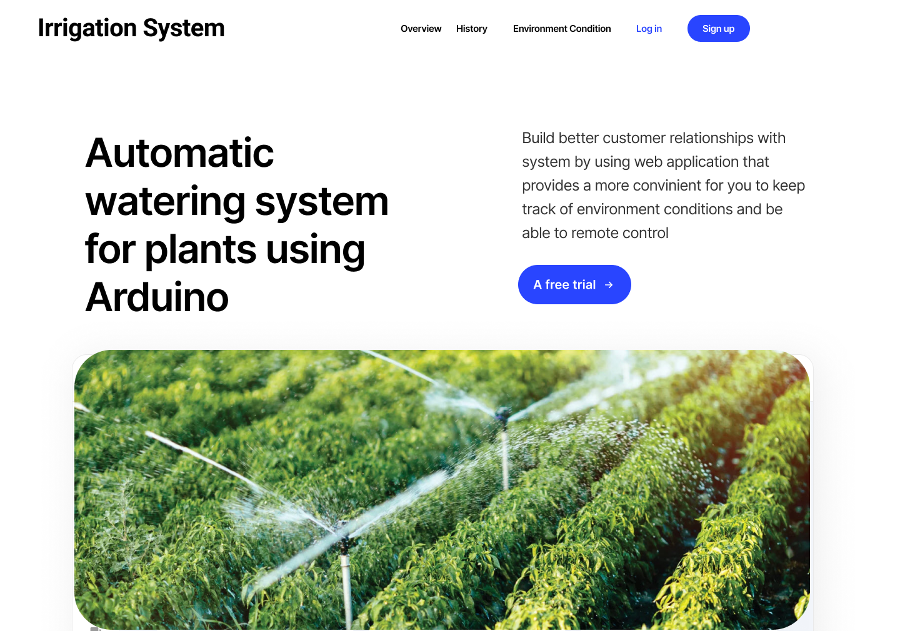
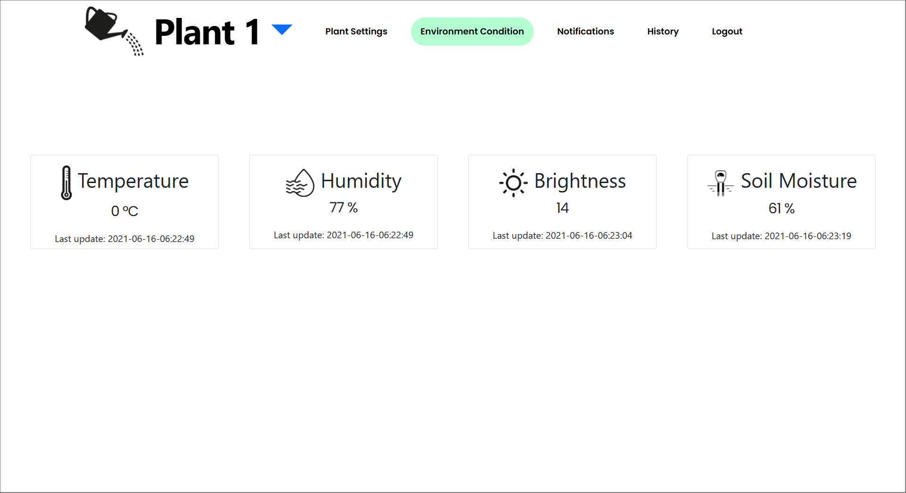
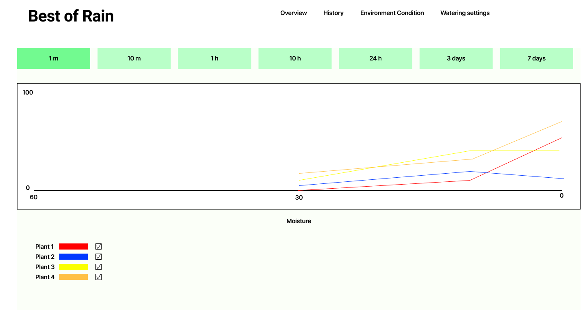
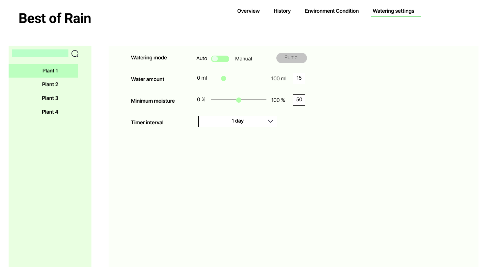

<!-- icons  -->
[1.1]: https://img.shields.io/badge/GitHub-100000?style=for-the-badge&logo=github&logoColor=white
[2.1]: https://img.shields.io/badge/LinkedIn-0077B5?style=for-the-badge&logo=linkedin&logoColor=white
[3.1]: https://img.shields.io/badge/Medium-12100E?style=for-the-badge&logo=medium&logoColor=white
[4.1]: https://img.shields.io/badge/Twitter-1DA1F2?style=for-the-badge&logo=twitter&logoColor=white

<!-- links to your social media accounts -->
[1]: https://github.com/produdez
[2]: https://www.linkedin.com/in/produdez/
[3]: https://medium.com/@produde
[4]: https://twitter.com/_Produde_

# Smart Irrigation System

"Best of rain"

<p align="center">
    
</p>

**Description:**

Plant monitoring and watering system. A web-app backed by IOT through MQTT interface. (FRONTEND)



This repo is the front-end of this project. Backend is [Here](https://github.com/produdez/iot-project-nodejs)

Project's report can be found [Here](https://www.overleaf.com/read/wbcgwwwmqryj)

## General Information

- Solution for busy people with their plants
- Support monitoring of lighting, humidity, soil moisture and temperature
- Manually trigger watering
- Or set threshold for automatic watering

## Technologies Used

- Firebase Auth
- Firebase Database
- React

## Features

1. Show current environment conditions
   
2. Show history and graphing of past environment variables
    
3. Setup watering condition and water amount
   
## Setup

Requirements and Installations:

1. git, node
2. Clone repository
3. Install dependencies

    ```[bash]
    # Install dependencies
    $ npm install
    ```

## Usage

1. Run

    ```[bash]
        # Run the app
        $ npm start
    ```

2. Access website at `localhost:3000`

## Future improvements

1. Support multiple plants
2. Better pump controls
3. Smarter watering behavior (example could be to stop watering for 5-10 minutes after an activation)
4. Better UI
5. Better notification insights
6. More detailed history graphs
7. ...

## Contact

Created by [@produdez](https://github.com/produdez) - feel free to contact me or follow my blog on medium ❤️!

<!-- [![alt text][1.1]][1] -->
[![alt text][2.1]][2]
[![alt text][3.1]][3]
[![alt text][4.1]][4]
